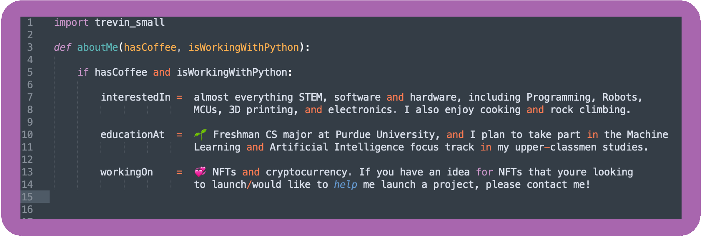

# Nice to meet you, I'm @Trevin-Small 

#### - [Mesmerizing Javascript Animations! (Hit Spacebar/Click)](https://trevin-small.github.io/Fractals-JS/)
#### - [Checkout My Website! 🔥  *Mobile not supported yet :(*](https://trevin-small.github.io/Trevins-website/)
#### - [My Latest Personal Project!](https://www.werms-nfts.com/)

### 🙋‍♂️ About me 
---

### ⚙️ Technologies/Tools
---

 

 

### 📫 Contact me: 
---
- [ LinkedIn](https://www.linkedin.com/in/trevin-klint-small/)
&nbsp;

### 📈 Stats
---

 
 
 

  

<!---
Trevin-Small/Trevin-Small is a ✨ special ✨ repository because its `README.md` (this file) appears on your GitHub profile.
You can click the Preview link to take a look at your changes.
--->
