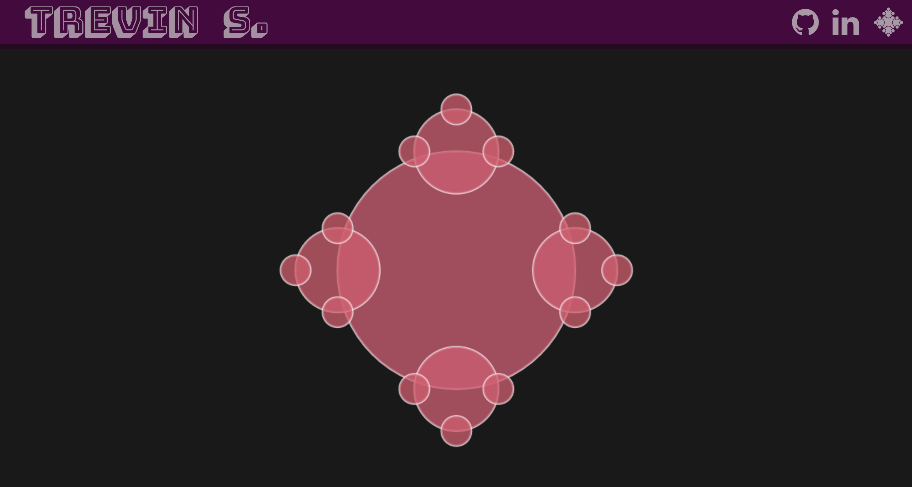
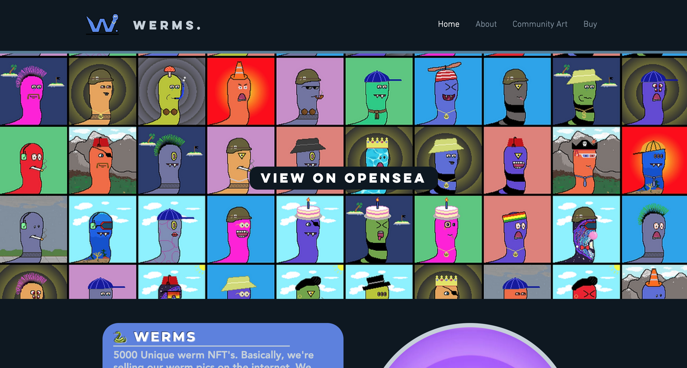
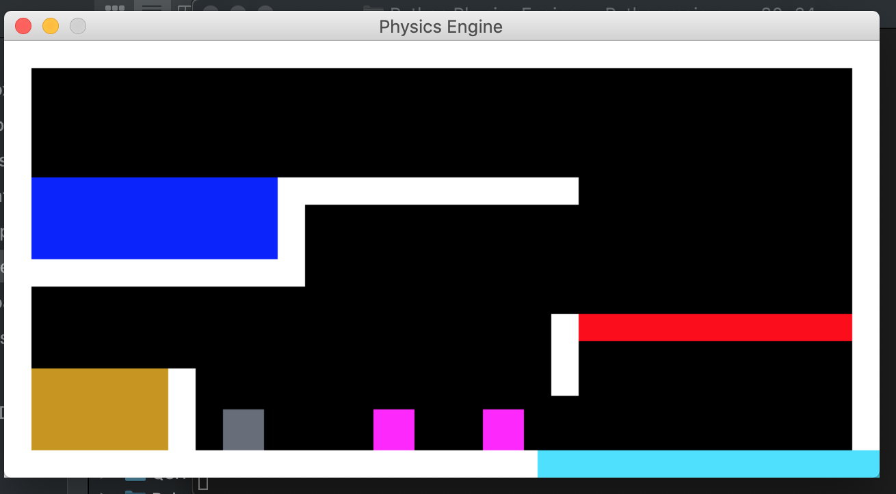
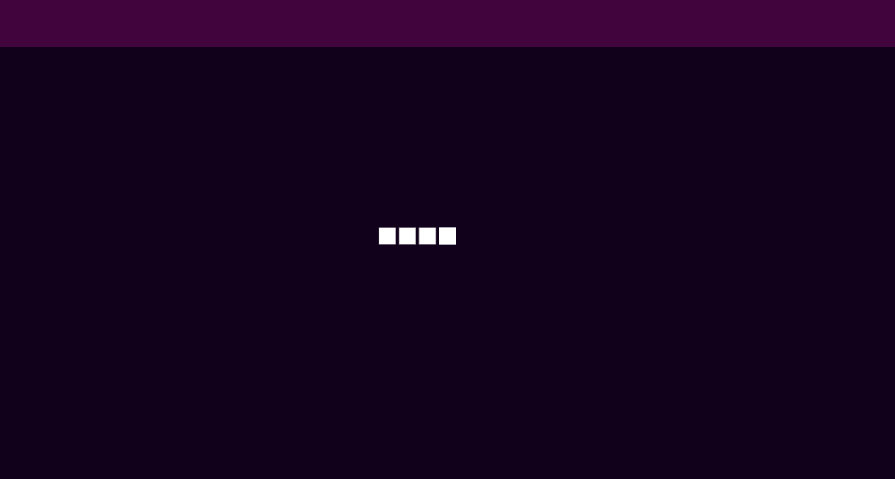

### 🙋‍♂️  About me
---

### 💻  Some of my Work
---
<table>
    <tr>
        <td>
               
            <a href="https://trevin-small.github.io/Fractals-JS/"><h4>JS Fractals</h4></a>
         </td>
        <td>
             
              
            <a href="https://www.werms-nfts.com/"><h4>Werms NFT's</h4></a>
        </td>
    </tr>
    <tr>
        <td>
             
              
            <a href="https://github.com/Trevin-Small/Data-Scraper-V2"><h4>Driggs Title Data Entry Bot</h4></a>
        </td>
        <td>
             
              
            <a href="https://github.com/Trevin-Small/Python-Physics-Engine"><h4>Python Physics Engine</h4></a>
        </td>
    </tr>
    <tr>
        <td>
             
              
            <a href="https://trevin-small.github.io/snake-js/"><h4>Snake Game (Unfinished)</h4></a>
        </td>
        <td>
             
              
            <a href="https://github.com/Trevin-Small/Python-Physics-Engine"><h4>Python Physics Engine</h4></a>
        </td>
    </tr>
</table>

### ⚙️  Technologies/Tools
---
&logoColor=white&color=f571b1" style="background-color:transparent;">
&logoColor=white&color=637eeb" style="background-color:transparent;">
&logoColor=white&color=637eeb" style="background-color:transparent;">
&logoColor=white&color=2bbc8a" style="background-color:transparent;">
&logoColor=white&color=2bbc8a" style="background-color:transparent;">
&logoColor=white&color=2bbc8a" style="background-color:transparent;"> 
&logoColor=white&color=2bbc8a" style="background-color:transparent;">
&logoColor=white&color=2bbc8a" style="background-color:transparent;">
&logoColor=white&color=aebfb8" style="background-color:transparent;">
&logoColor=white&color=aebfb8" style="background-color:transparent;">
&logoColor=white&color=aebfb8" style="background-color:transparent;">
&logoColor=white&color=aebfb8" style="background-color:transparent;">
&logoColor=white&color=ffc72e" style="background-color:transparent;">
&logoColor=white&color=ffc72e" style="background-color:transparent;">

### 📈  GitHub Stats
---

 
 

  
